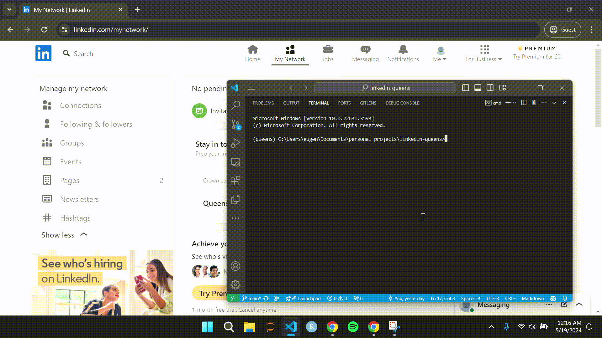
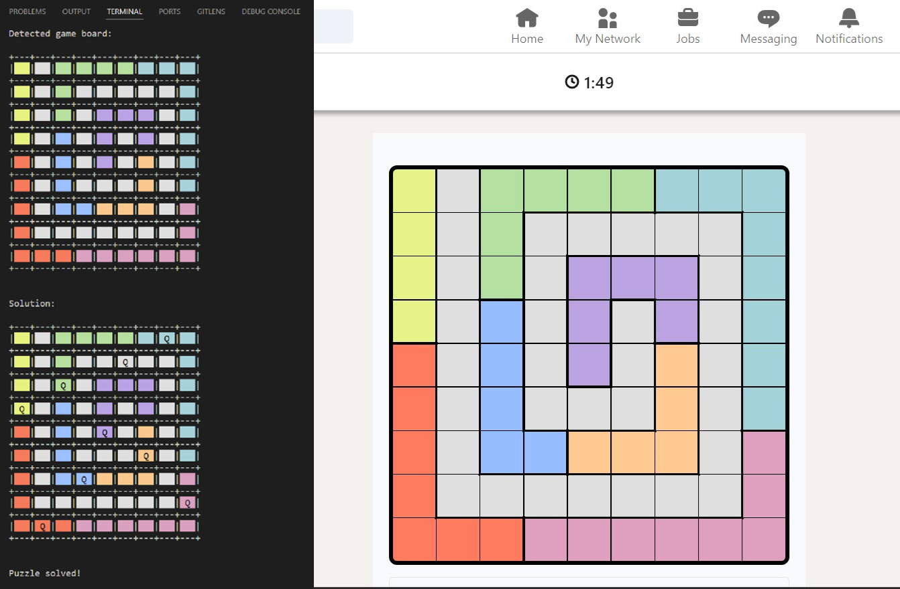

# linkedin-queens

Program to automatically solve the LinkedIn Queens game using `opencv-python` for game board detection, `pyautogui` for mouse control, and a simple backtracking algorithm to solve the puzzle.


<p align="center">
    Demonstration of the program in action. The program automatically detects the game board, finds the solution, clicks in the correct squares, and exits. This all happens in 1-2 seconds.
</p>

<br/>
<br/>


<p align="center">
    For debugging purposes, the program prints out the detected game board and the solution it found to the console, preserving LinkedIn's original colors and making it easy to tell if the program is working correctly.
</p>

## Setup

1. Clone the repository and navigate to the project folder.
2. Create a virtual environment and install the dependencies. The project was developed in Python 3.11.9.
    ```
    python -m venv <envname>
    source <envname>/bin/activate
    pip install -r requirements.txt
    ```
3. To run the project, execute the following command:
    ```
    python main.py
    ```
4. Make sure LinkedIn is open in Google Chrome* with the window maximized on your primary monitor (if you have multiple monitors). The program works best when LinkedIn's display is set to Light Mode. Dark Mode will frequently result in incorrect detections which will mess up the rest of the code logic. Note that the program assumes a 1920x1080 resolution&mdash;the template matching will likely not work otherwise.
5. Navigate to the [Queens game page](https://www.linkedin.com/games/queens/) while the program is running and start the game. The program should automatically solve the puzzle for you and exit once it has completed the game.

*The program was tested on Google Chrome. It may work on other browsers, but this is not guaranteed.

## Future Work

I don't plan on working on this project anymore, but I'll happily accept pull requests. Some potential improvements include:
- Support for different screen resolutions, maybe through multi-scale template matching or something more clever and robust
- Better support for Dark Mode
- Support for people using WSL; there is a known issue with the `mss` library in that it isn't able to capture the Windows desktop and can only communicate with Linux processes
- Test the program on different browsers and make it browser-agnostic if there are any issues
- Figure out how to make the program stop flagging other windows like the terminal as the game board
- Better error handling, logging, detecting if the puzzle has already been solved, etc.